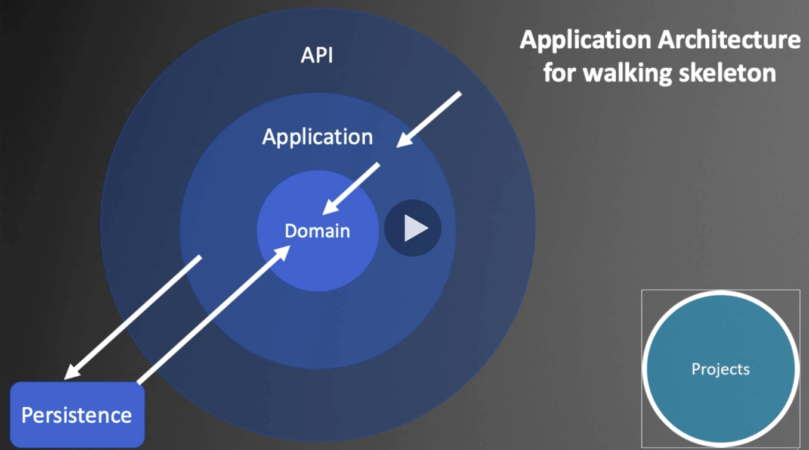

## DOTNET CLI

dotnet --info

Create a solution file

```
dotnet new sln
```

Create Domain/Persistence/Application projects

```
dotnet new classlib -n Domain
dotnet new classlib -n Application
dotnet new classlib -n Persistence
```

Create API project

```
dotnet new webapi -n API
```

Add project to a solution file

```
dotnet sln add Domain/
dotnet sln add Application/
dotnet sln add Persistence/
dotnet sln add API/
```

```
dotnet sln list
```

Add Domain/Persistence as dependencies of Application project

```
cd Application
dotnet add reference ../Domain/
dotnet add reference ../Persistence/
```

Add Application project as an dependency of API project

```
cd API
dotnet add reference ../Application/
```

Add Domain project as an dependency of Persistence project

```
cd Persistence
dotnet add reference ../Domain/
```

Go to starter project(API in this case) and run the application

```
dotnet run -p API/
e.g. localhost:5000/api/values/33
```

---

## Create Domain Entities

Add 2 dependencies `Microsoft.EntityFrameworkCore`, `Microsoft.EntityFrameworkCore.Sqlite` and `Microsoft.EntityFrameworkCore.Design` to `Persistence` project.

```
dotnet restore
```

Create `DataContext : DbContext` class.

Install Entity Framework

```
dotnet tool install --global dotnet-ef
```

Create a DB migration

```
// -p where the data context is, -s start project
dotnet ef migrations add InitialCreate -p Persistence/ -s API/
dotnet ef migrations add SeedValues -p Persistence/ -s API/
```

Create a DB

```
var context = services.GetRequiredService<DataContext>();
context.Database.Migrate();
```

Run the service application

```
cd API/
dotnet watch run
```

Seeding data

```
protected override void OnModelCreating(ModelBuilder builder)
{
    builder.Entity<Value>().HasData(
        new Value { Id = 1, Name = "Value 101" },
        new Value { Id = 2, Name = "Value 102" },
        new Value { Id = 3, Name = "Value 103" }
    );
}
```

Read data from DB into controller - inject `DataContext` into `ValuesController`



## Create Client Application

```
cd Reactivities/
npx create-react-app client-app --use-npm --typescript
cd client-app
```
